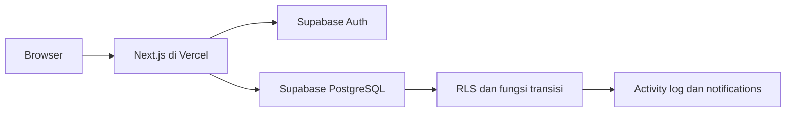
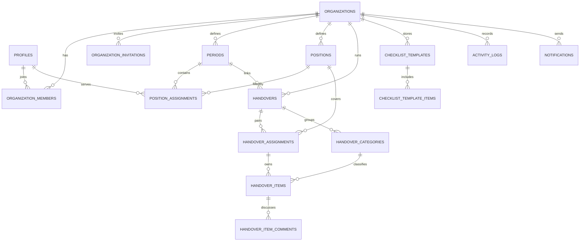

# Technical Design Handover KODISIA

- **Versi:** 1.0 · 29 September 2026
- **Status:** Rancangan yang dipakai implementasi; migration dan kode aplikasi disiapkan, belum diterapkan ke Supabase pengembangan
- **Acuan:** [BRD](BRD.md) dan [PRD](PRD.md) versi 1.2

## 1. Keputusan arsitektur

MVP melayani KODISIA lebih dahulu. Setiap data bisnis tetap membawa `organization_id` dan dilindungi RLS agar organisasi lain dapat didukung kelak tanpa migrasi isolasi besar. Anggota masuk melalui undangan admin; tidak ada pendaftaran publik pada pilot. Hanya satu handover aktif untuk pasangan periode yang sama. Admin boleh membantu review jika bukan penyerah, dan setiap tindakannya diaudit.

Stack: Next.js App Router + TypeScript + Tailwind CSS + shadcn/ui, Supabase Auth/PostgreSQL/RLS, Vercel, GitHub. Next.js menangani routing, rendering, server actions, dan operasi admin yang membutuhkan kredensial server. PostgreSQL adalah sumber kebenaran status, progres, dan audit. Supabase Auth mengelola identitas; RLS adalah batas akses data, bukan sekadar penyembunyian UI. Tidak ada backend terpisah.

**Batas fase:** Dokumen ini mengunci bentuk rancangan. Project Setup membuat repository, app, konfigurasi UI, dan koneksi layanan. SQL migration, halaman auth, serta workflow item dibangun pada Foundation/Core Workflow setelah proyek layanan dan environment tersedia.

**Catatan implementasi:** Migration sumber kebenaran berada di `supabase/migrations/` dan harus dijalankan berurutan. Route `search` dan `activity` tingkat organisasi ditambahkan untuk memenuhi pencarian lintas arsip dan riwayat yang disebut PRD. `docs/SETUP.md` mencatat aktivasi database, template email Auth, serta environment. Perbedaan dokumentasi ini tidak mengubah business rules PRD.

## 2. Model data v1

Semua ID memakai UUID; `created_at`/`updated_at` disimpan sebagai `timestamptz` UTC. Waktu ditampilkan dalam `Asia/Jakarta` untuk pilot. Konsep status dan role menggunakan tipe yang dibatasi; nilai persis enum/check ditentukan dalam migration. Semua tabel tenant punya `organization_id` yang konsisten. Foreign key komposit atau pemeriksaan transaksi memastikan referensi tidak menyeberang organisasi.

| Tabel | Field bisnis utama | Kunci dan batasan |
| --- | --- | --- |
| `profiles` | `id`, nama tampilan | `id` = Supabase Auth user ID. Jangan menyalin password. |
| `organizations` | `id`, `slug`, nama, logo URL, timezone | `slug` unik; workspace KODISIA dibuat oleh bootstrap terkontrol. |
| `organization_members` | `organization_id`, `user_id`, `roles`, status | Unik per org/user. `roles` dapat memuat admin, outgoing, incoming; assignment tetap diperlukan untuk aksi item. Admin aktif terakhir tidak boleh dicabut. |
| `organization_invitations` | `organization_id`, email ternormalisasi, roles, pengundang, expiry, status | Hanya admin dapat membuat. Penerimaan mensyaratkan email terverifikasi yang sama. Token undangan Auth tidak disimpan plaintext. |
| `periods` | `organization_id`, label, tanggal mulai/akhir opsional | Label unik dalam organisasi; periode asal dan tujuan harus berbeda. |
| `positions` | `organization_id`, nama jabatan, divisi opsional, aktif | Nama posisi unik menurut aturan organisasi; perubahan tidak menulis ulang sejarah. |
| `position_assignments` | `organization_id`, `period_id`, `position_id`, `user_id` | Satu anggota bisa memegang lebih dari satu posisi; tidak ada duplikasi kombinasi. |
| `handovers` | `organization_id`, periode asal/tujuan, status, target, waktu buka/tutup | Satu `active` per kombinasi organisasi + periode asal + tujuan melalui unique partial index. `completed` read-only sampai reopen admin. |
| `handover_assignments` | `handover_id`, `position_id`, outgoing user, incoming user | Pasangan penyerah/penerima per posisi; kedua user aktif dan berbeda. Item menunjuk assignment ini. |
| `handover_categories` | `handover_id`, nama, urutan | Default Accounts, Documents, Programs, Stakeholders, Tasks; unik per handover. |
| `checklist_templates` | `organization_id`, nama, status aktif | Template hanya dalam organisasi; perubahan tidak mengubah salinan terdahulu. |
| `checklist_template_items` | template, kategori, judul, deskripsi awal, required, urutan | Disalin sebagai item independen saat admin menerapkan template. |
| `handover_items` | assignment, kategori, judul, deskripsi, detail kategori, referensi URL, required, aktif, due date, status, submission/review metadata, version | `details` JSONB dengan validasi aplikasi menurut kategori; status tunggal. `verified_by` boleh incoming atau admin sah, tidak boleh outgoing. `version` untuk optimistic concurrency. |
| `handover_item_comments` | item, penulis, isi, penanda alasan revisi, waktu | Komentar tidak diedit/dihapus dalam MVP. |
| `activity_logs` | organisasi, handover/item opsional, aktor, event, perubahan aman, alasan, waktu | Append-only; dibuat atomik bersama perubahan bisnis. Tidak menyimpan secret atau URL bertoken. |
| `notifications` | organisasi, penerima, item, event, waktu, read-at, dedupe key | Hanya penerima membaca; akses ke item tetap diperiksa ketika tautan dibuka. |

Status item: `not_started`, `in_progress`, `ready_for_review`, `revision_required`, `verified`. Status handover: `draft`, `active`, `completed`. Status pekerjaan dalam kategori Tasks dan status transfer aset dalam Accounts/Documents adalah **field konten**, tidak mengubah status item handover secara otomatis.

**Referensi eksternal:** MVP menyimpan label dan URL, tanpa upload native. URL dibatasi ke skema aman; jangan menyimpan token pada query string. Untuk stakeholder, catat hanya kontak yang disetujui organisasi untuk dilihat semua anggota aktif.

### ERD konseptual

## 3. Transaksi dan business invariants

Gunakan fungsi database atau satu transaksi server terkontrol untuk operasi yang harus atomik. RLS tetap aktif pada tabel yang dapat diakses dari klien. Fungsi `SECURITY DEFINER`, bila dipakai, harus memakai `search_path` tetap, memeriksa `auth.uid()` dan membership, serta tidak menerima actor ID dari klien sebagai otoritas.

| Operasi | Pemeriksaan wajib | Perubahan atomik |
| --- | --- | --- |
| Bootstrap organisasi | Jalur admin pilot terkontrol | Organization + admin membership; tidak boleh menghasilkan workspace tanpa admin. |
| Terima undangan | Sesi dan email terverifikasi cocok dengan undangan aktif | Invitation accepted + membership aktif, idempotent. |
| Aktifkan handover | Admin; pasangan periode sah; ≥1 item wajib dengan assignment sah | `draft → active`; unique partial index menolak handover aktif kedua. |
| Submit item | Handover active; outgoing assigned; isi minimum lengkap; incoming aktif dan berbeda | Status `ready_for_review`, metadata submission, activity event, notifikasi reviewer. |
| Request revision | Status ready; incoming assigned atau admin bukan outgoing; alasan wajib | Status `revision_required`, komentar alasan, audit, notifikasi outgoing. |
| Verify item | Status ready; incoming assigned atau admin bukan outgoing | Status `verified`, `verified_by/at`, audit, notifikasi terkait. |
| Reopen item | Admin, alasan wajib, handover active/reopened | Status `in_progress`, metadata verifikasi lama tetap di audit; progres dihitung ulang. |
| Tutup handover | Admin; semua item wajib aktif verified; denominator >0 | Status `completed`, audit. |

Mutasi item menggunakan `version` untuk mencegah lost update: perubahan dengan versi lama mendapat konflik dan pengguna diminta memuat ulang. Perubahan assignment pada item yang sedang menunggu review mengembalikan item ke `in_progress` dengan audit. Penghapusan permanen item verified dan pengubahan audit tidak disediakan.

## 4. Matriks RLS v1

`member(org)` berarti membership aktif milik `auth.uid()`. `admin(org)` berarti role admin dalam membership aktif. Akses ke satu baris harus dibatasi oleh `organization_id`, kemudian oleh assignment atau penerima bila aksi mutasi. Jangan memakai `service_role` untuk request biasa, karena kunci itu melewati RLS.

| Data | SELECT | INSERT/UPDATE/DELETE |
| --- | --- | --- |
| Organization, periods, positions, assignments, handovers, categories, templates | Member org | Admin org melalui jalur yang memvalidasi invariants. |
| Members | Member org melihat daftar minimal | Admin org mengundang/mengubah, kecuali menghapus admin aktif terakhir. |
| Invitations | Admin org; penerima hanya melalui alur token tervalidasi | Admin org/server trusted. |
| Items | Member org | Outgoing assigned mengedit draft/revisi dan submit; admin mengelola metadata dengan alasan; review lewat fungsi transisi khusus. |
| Comments | Admin atau outgoing/incoming terkait | Pihak terkait pada handover active; tidak ada edit/hapus. |
| Activity logs | Member org | Hanya fungsi audit internal; tidak ada update/delete pengguna. |
| Notifications | Penerima sendiri yang masih member org | Dibuat sistem; penerima hanya mengubah `read_at`. |
| Profiles | Diri sendiri; nama tampilan anggota lain melalui daftar anggota org | Pengguna mengubah profil sendiri. |

**Uji wajib:** anon tidak dapat membaca data internal; anggota KODISIA tidak dapat membaca organisasi kedua; outgoing tidak dapat verify; admin yang outgoing tidak dapat verify itemnya; incoming lain tidak dapat review; user yang dinonaktifkan langsung kehilangan akses; referensi lintas organisasi ditolak meski ID diketahui; notifications dan pencarian tidak membocorkan data. Uji pada API/database, tidak cukup pada UI.

## 5. Auth dan undangan

1. Admin KODISIA memasukkan email dan role. Operasi server menggunakan kredensial admin layanan hanya untuk mengirim undangan Supabase Auth dan mencatat undangan organisasi; kredensial ini tidak pernah masuk client bundle.
2. Penerima membuka tautan Auth yang valid, menyelesaikan identitas/password sesuai konfigurasi Auth, lalu aplikasi memverifikasi email dan undangan sebelum membuat membership aktif.
3. Browser memakai Supabase client untuk login/logout. Server memakai `@supabase/ssr` dengan cookie; Next.js Proxy memperbarui token sebelum server component membaca user. Operasi server memakai `getUser()`/klaim terverifikasi, bukan mempercayai `getSession()` sebagai otorisasi.
4. Setiap request data mengevaluasi membership dan RLS. Pindah workspace mengubah konteks URL, bukan mengubah hak akses.
5. Redirect Auth hanya ke URL yang diizinkan untuk lokal dan Vercel; callback menolak tujuan di luar allowlist. Tidak ada form daftar publik.

`@supabase/ssr` masih ditandai beta pada dokumentasi Supabase; adapter client/server disimpan dalam satu modul agar perubahan API terlokalisasi.

## 6. Route map Next.js

| Route | Akses | Tujuan |
| --- | --- | --- |
| `/` | Publik | Landing ringkas KODISIA dan tautan masuk. |
| `/login`, `/auth/callback`, `/auth/invite`, `/reset-password` | Publik/token sah | Login, penerimaan undangan, pemulihan. |
| `/workspaces` | Login | Pilih organisasi yang diikuti; pilot menampilkan KODISIA. |
| `/org/[slug]/overview` | Member | Dashboard dan hambatan. |
| `/org/[slug]/my-tasks` | Member | Tugas outgoing/incoming pribadi. |
| `/org/[slug]/handovers` | Member | Handover aktif dan arsip. |
| `/org/[slug]/handovers/[id]` | Member | Ringkasan, posisi, kategori. |
| `/org/[slug]/handovers/[id]/items` | Member | Cari dan filter item. |
| `/org/[slug]/handovers/[id]/items/[itemId]` | Member | Detail, komentar, aksi yang diizinkan. |
| `/org/[slug]/handovers/[id]/activity` | Member | Riwayat handover. |
| `/org/[slug]/notifications` | Member | Notifikasi pribadi. |
| `/org/[slug]/settings/members`, `/periods`, `/positions`, `/templates` | Admin | Pengaturan organisasi. |

Sebuah page/server action selalu memvalidasi `slug`, ID handover/item, dan kesamaan organisasi. Gunakan 404 untuk sumber yang tidak boleh diketahui tenant lain; 403 untuk anggota sah yang kurang izin melakukan aksi. Loading/error/empty state dan viewport kecil mengikuti PRD.

## 7. Activity log, notifikasi, dan progres

Audit event dibuat dalam transaksi yang sama dengan perubahan status/data. Simpan `actor_id`, `organization_id`, `entity_type/id`, `event_type`, waktu, status lama/baru yang aman, serta alasan jika diwajibkan. Teks bebas dan URL bertoken tidak masuk log. Log append-only; koreksi dilakukan dengan event baru. Perubahan membership, assignment, flag required, reopen, submit, revision, verify, dan close semuanya wajib tercatat.

Notifikasi dibuat dari event bisnis yang berhasil. Gunakan `dedupe_key` untuk assignment/status/tenggat agar retry tidak menggandakan pesan. Tenggat mendekat dihitung harian dengan zona waktu organisasi dan tidak mengirim notifikasi berulang tanpa batas. Notifikasi memiliki `read_at`; membacanya tidak mengubah status item. Jika hak anggota dicabut, notifikasi lama tidak membuka item.

Completion = `verified required active / all required active`. Denominator nol ditampilkan sebagai kosong. View/query agregat yang menghormati RLS menghitung total, kategori, dan posisi dari status database yang sama. Jangan mengandalkan hitungan di client sebagai sumber kebenaran.

## 8. Lingkungan, deployment, dan operasi

| Lingkungan | Tujuan |
| --- | --- |
| Local | Pengembangan dengan `.env.local` yang tidak dikomit. |
| Preview | Vercel preview + Supabase project nonproduksi; tidak memakai data nyata KODISIA. |
| Production | Vercel production + Supabase production; hanya setelah UAT dan security gate. |

Environment minimal: `NEXT_PUBLIC_SUPABASE_URL`, `NEXT_PUBLIC_SUPABASE_PUBLISHABLE_KEY`, dan kunci server untuk operasi undangan (`SUPABASE_SECRET_KEY`) hanya jika benar-benar diperlukan. `.env.example` berisi nama dan placeholder, bukan nilai rahasia. Validasi environment saat startup/build untuk fitur yang membutuhkannya. Jangan memuat secret key pada komponen client atau log.

Migration SQL disimpan di repo dan diterapkan berurutan pada nonproduksi lalu production. Seed KODISIA hanya untuk data yang disetujui; akun pengguna nyata masuk via undangan. Backup dan prosedur restore diperiksa sesuai paket Supabase yang dipilih sebelum pilot. Error monitoring tidak menyimpan isi item, kontak, atau token. Deploy production mengikuti gerbang go/no-go PRD.

## 9. Tahapan dan gerbang implementasi

1. **Setup:** scaffold Next.js/TypeScript/Tailwind/shadcn, token brand, lint/typecheck/build, GitHub, konfigurasi Supabase dan Vercel bila akses tersedia.
2. **Foundation:** migration inti, RLS, Auth undangan, organisasi/member, periode/posisi, uji lintas tenant.
3. **Core workflow:** handover, template/item, fungsi transisi atomik, komentar, audit, notifications.
4. **Visibility dan QA:** dashboard, pencarian, mobile, aksesibilitas, pengujian role/RLS/e2e.
5. **Pilot:** data KODISIA yang disetujui, UAT, verifikasi backup, rilis production, evaluasi.

**Keputusan tersisa sebelum pilot:** pemilik permintaan ekspor/penghapusan data dan format periode KODISIA. Keduanya tidak menghalangi setup repository, tetapi harus ditetapkan sebelum fitur/data terkait dipakai dalam pilot.

## Referensi teknis resmi

- [Next.js App Router installation](https://nextjs.org/docs/app/getting-started/installation)
- [Supabase Auth server-side rendering](https://supabase.com/docs/guides/auth/server-side)
- [Supabase SSR client for Next.js](https://supabase.com/docs/guides/auth/server-side/creating-a-client?framework=nextjs)
- [shadcn/ui installation for Next.js](https://ui.shadcn.com/docs/installation/next)
- [Vercel CLI project linking](https://vercel.com/docs/cli/link)
